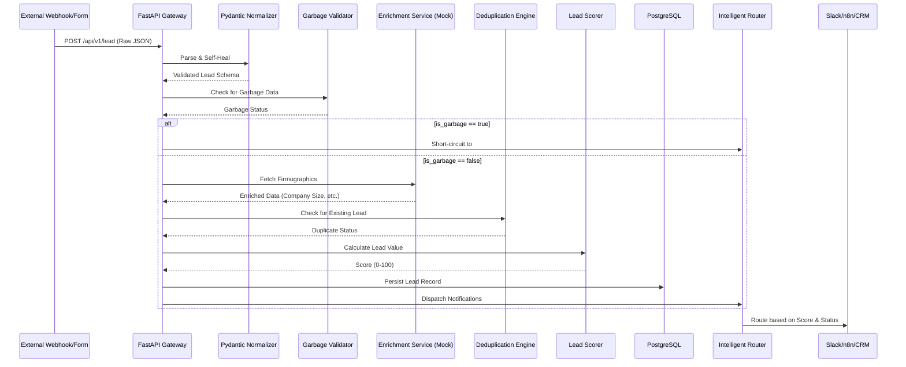

# 🏗️ Architecture Tour

This document serves as the technical blueprint for LeadMend. It outlines the data lifecycle, system boundaries, and provides a map for navigating the implementation of complex patterns.

---

## 🔄 Data Lifecycle (The Pipeline)

The following diagram illustrates the exact path a raw lead payload takes through the system. Each step is designed to be resilient and idempotent.

---

## 🛡️ External State & Mocking Strategy

LeadMend is designed to be easily testable and portable. We use a "Pluggable Microservice" strategy for external dependencies:

### 1. Enrichment API (Mock)
In production, this would connect to services like Clearbit, Apollo, or ZoomInfo. To ensure zero-friction development, we include a `mock_enrich` service in Docker.
- **Mechanism**: A lightweight Python server that returns deterministic enrichment data based on the email domain provided.
- **Reasoning**: This allows developers to test "Self-Healing" and "Enrichment" logic without API keys or external network costs.

### 2. Workflow Orchestration (n8n)
Instead of hardcoding complex CRM logic into the backend, we offload orchestration to n8n.
- **Mechanism**: The backend sends a clean JSON payload to an n8n webhook.
- **Reasoning**: This provides a visual interface for marketing teams to adjust lead routing rules without changing backend code.

---

## 🔍 "Where to Look" Guide

Use this index to find implementations of critical architectural patterns:

| Pattern | Implementation Path | Rationale |
| :--- | :--- | :--- |
| **Self-Healing Logic** | [lead.py](file:///backend/app/schemas/lead.py) | Pydantic validators that extract emails from message bodies and handle malformed strings. |
| **Garbage Detection** | [validator.py](file:///backend/app/services/validator.py) | Filtering logic to short-circuit nonsensical payloads before enrichment. |
| **Enrichment Orchestration** | [enricher.py](file:///backend/app/services/enricher.py) | Async HTTP client logic with timeout handling and fallback defaults. |
| **Fuzzy Deduplication** | [deduplicator.py](file:///backend/app/services/deduplicator.py) | SQL-based exact matches and logic for identifying returning leads. |
| **Algorithmic Scoring** | [scorer.py](file:///backend/app/services/scorer.py) | Multi-factor weighted scoring based on company size, industry, and data quality. |
| **Tiered Routing** | [router.py](file:///backend/app/services/router.py) | Logic that maps scores to specific Slack channels and CRM webhooks. |
| **Notification Retries** | [slack_notifier.py](file:///backend/app/services/slack_notifier.py) | Resilient delivery of alerts with proper error handling. |

---

## 🛠️ Infrastructure Topology

The project uses `docker-compose.yml` to define a unified environment:
- **`backend`**: The primary FastAPI application.
- **`frontend`**: Astro-based dashboard for real-time monitoring.
- **`db`**: PostgreSQL 15 instance.
- **`n8n`**: Automation engine for external integrations.
- **`mock-enrich`**: Simulated enrichment microservice.
